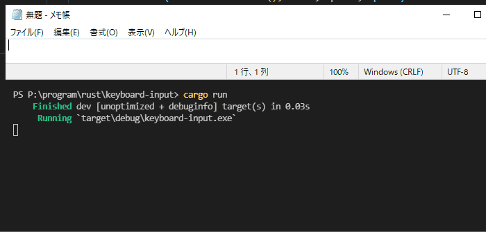

# background-keyboard-inputs

This is written with reference to [C++/Win32: Keyboard input to a non-foreground window - Stack Overflow](https://stackoverflow.com/questions/65210101/c-win32-keyboard-input-to-a-non-foreground-window).

## Environment

```powershell
PS C:\Users\owner> [System.Environment]::OSVersion.Version
Major  Minor  Build  Revision
-----  -----  -----  --------
10     0      19044  0


PS C:\Users\owner> rustc -V
rustc 1.63.0-nightly (a6b8c6954 2022-06-03)
```

## Capture


