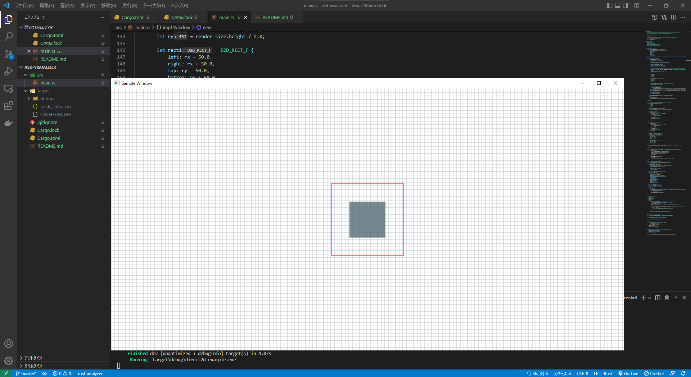

# direct2d-example-2022

This is written with reference to the following list.

- [Creating a Simple Direct2D Application - Win32 apps | Microsoft Docs](https://docs.microsoft.com/en-us/windows/win32/direct2d/direct2d-quickstart)
  - [gabdube/D2D1_rs_simple_example: The direct 2D api used from rust.](https://github.com/gabdube/D2D1_rs_simple_example)
  - [hummingly/rust-direct2d-example](https://github.com/hummingly/rust-direct2d-example)
- [windows-rs/crates/samples/direct2d at master · microsoft/windows-rs](https://github.com/microsoft/windows-rs/tree/master/crates/samples/direct2d)

## Environment

`DirectX Version: DirectX 12`

```powershell
PS C:\Users\owner> [System.Environment]::OSVersion.Version
Major  Minor  Build  Revision
-----  -----  -----  --------
10     0      19044  0


PS C:\Users\owner> rustc -V
rustc 1.63.0-nightly (a6b8c6954 2022-06-03)
```

## Capture


