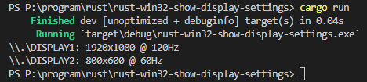

# show-display-settings

## Environment

```powershell
PS C:\Users\owner> [System.Environment]::OSVersion.Version
Major  Minor  Build  Revision
-----  -----  -----  --------
10     0      19044  0


PS C:\Users\owner> rustc -V
rustc 1.63.0-nightly (a6b8c6954 2022-06-03)
```

## Capture


